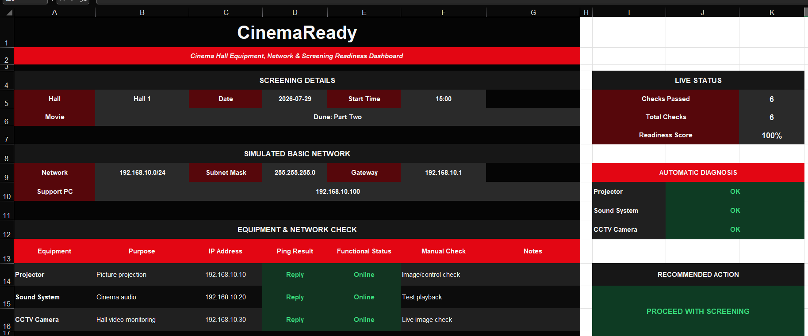
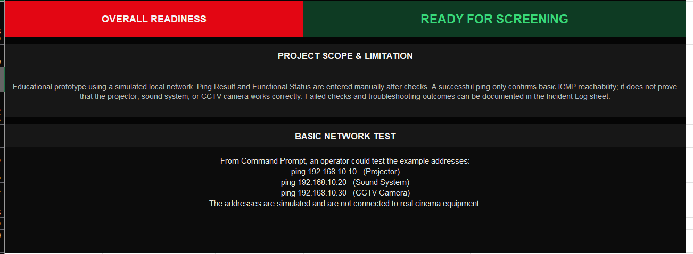
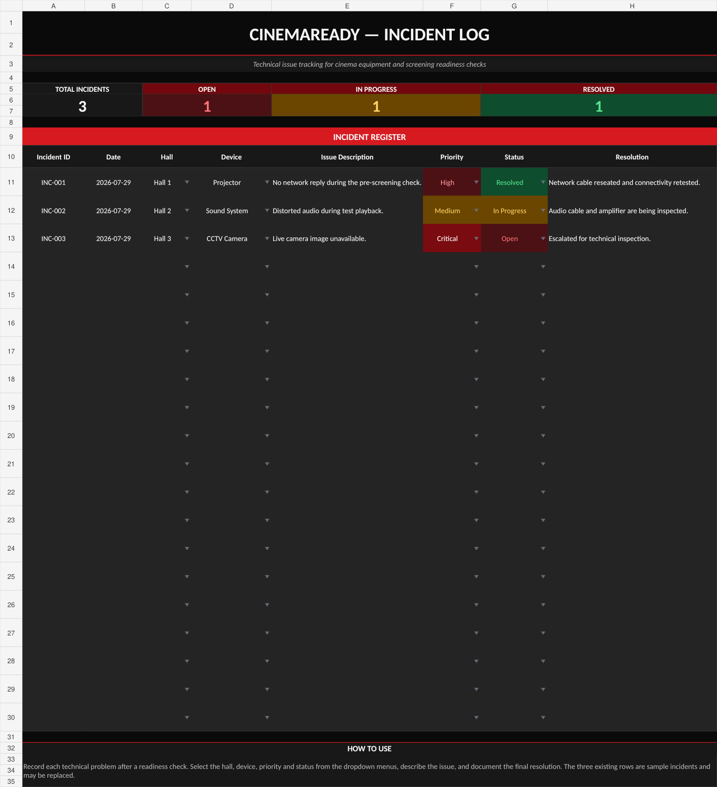
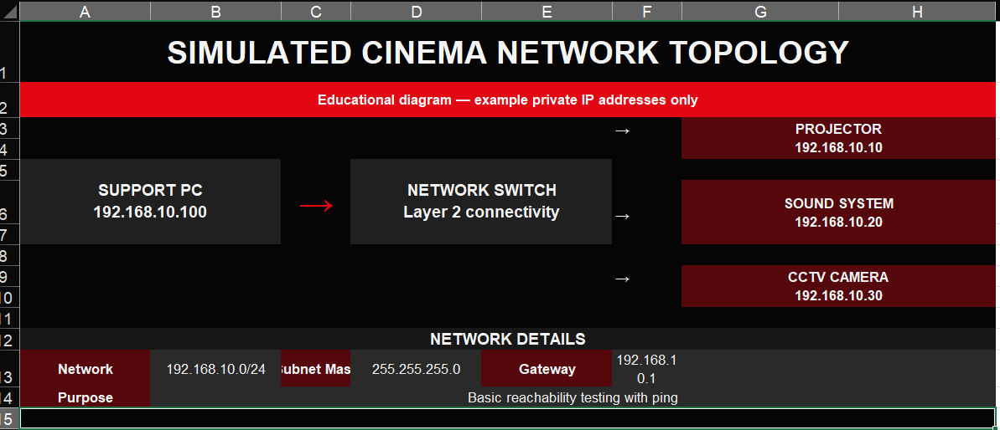
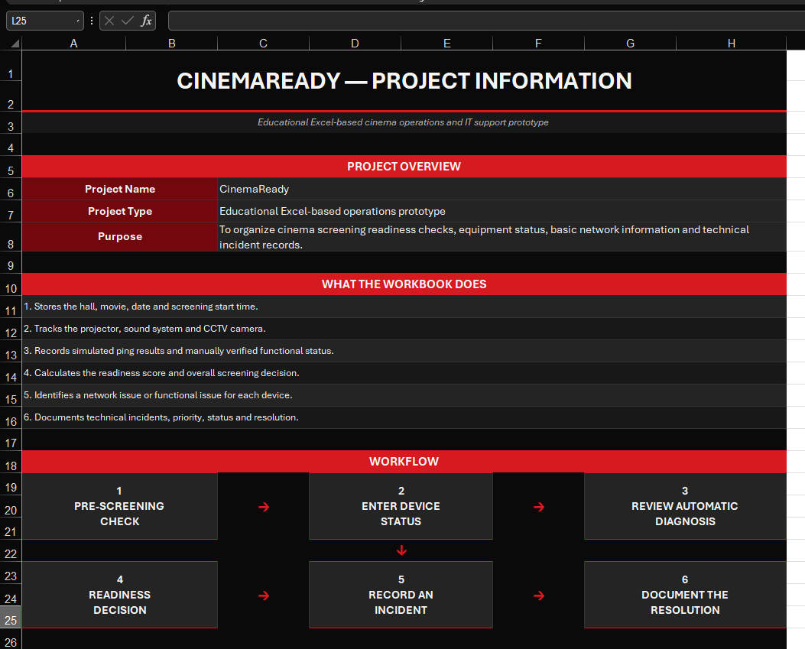
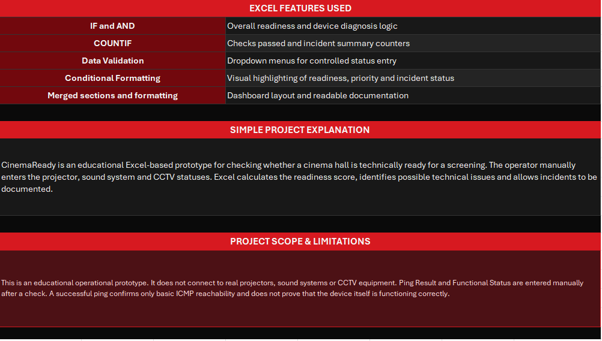

# CinemaReady

**CinemaReady** is an educational Microsoft Excel operational prototype for checking whether a cinema hall is technically ready for a screening.

It combines screening details, simulated equipment and network checks, formula-based readiness calculations, automatic issue diagnosis, incident tracking, and a visual network topology.

> **Important:** CinemaReady does not communicate with real cinema equipment. Network and functional statuses are entered manually for demonstration and learning purposes.

## Download

[Download the CinemaReady Excel workbook](./CinemaReady.xlsx)

## Main Dashboard

The dashboard contains screening details, a simulated network configuration, equipment checks, a live readiness score, automatic diagnosis, and a recommended action.

The lower section displays the final screening decision, project limitations, and example Command Prompt ping tests.

## Main Features

- Screening details for hall, movie, date, and start time
- Manual status entry for the projector, sound system, and CCTV camera
- Simulated private IP addressing and ping results
- Automatic readiness score and final screening decision
- Automatic diagnosis of network and functional issues
- Recommended operator action
- Technical incident tracking with priority, status, and resolution
- Visual network topology
- Project documentation inside the workbook

## Incident Tracking

The **Incident Log** worksheet demonstrates a simple IT support process for documenting equipment problems, priorities, status updates, and final resolutions.

Workflow:

1. Record the technical issue
2. Select the affected hall and device
3. Assign a priority
4. Track the incident status
5. Document the final resolution

## Simulated Network Topology

The **Network Map** worksheet visualizes an example connection between the support PC, network switch, projector, sound system, and CCTV camera.

| Component | Address |
|---|---|
| Network | `192.168.10.0/24` |
| Subnet Mask | `255.255.255.0` |
| Gateway | `192.168.10.1` |
| Support PC | `192.168.10.100` |
| Projector | `192.168.10.10` |
| Sound System | `192.168.10.20` |
| CCTV Camera | `192.168.10.30` |

All addresses are simulated private IP addresses used only for educational purposes.

## Project Information

The **Project Info** worksheet explains the project purpose, main functions, operational workflow, Excel features used, and project limitations.

## Excel Features Used

- `IF`
- `AND`
- `COUNTIF`
- Data Validation dropdown lists
- Conditional Formatting
- Cell references and percentage calculations
- Merged sections and dashboard formatting
- Formatted operational layouts

## How to Use

1. Download `CinemaReady.xlsx`.
2. Open it in Microsoft Excel.
3. Select the hall and enter the movie, date, and start time.
4. Update the equipment ping results and functional statuses.
5. Review the readiness score, automatic diagnosis, and recommended action.
6. Record technical problems in the **Incident Log** worksheet.
7. Document the resolution after troubleshooting.

## Skills Demonstrated

- Microsoft Excel
- Excel formulas and conditional logic
- Basic IP addressing
- Basic ICMP and ping concepts
- IT support workflow
- Troubleshooting logic
- Incident classification and documentation
- Operational reporting
- Technical project documentation

## Project Scope and Limitations

- No live network scanning
- No connection to real projectors, sound systems, or CCTV equipment
- Ping and functional statuses are entered manually
- A successful ping confirms only basic ICMP reachability
- A successful ping does not prove that the device itself is functioning correctly
- All network addresses and cinema equipment are simulated

## Author

**Boyan Nikolov**  
Aspiring IT Support and System Administration professional based in Sofia, Bulgaria.

[GitHub Profile](https://github.com/boyan-nk)
